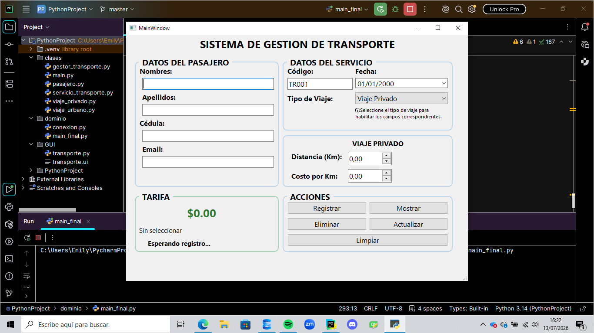
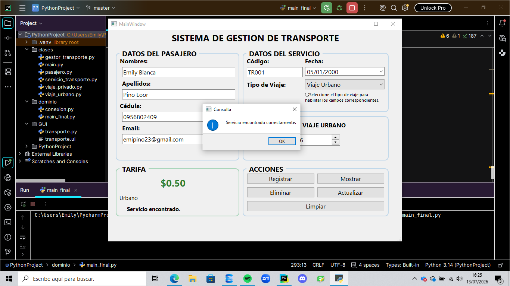
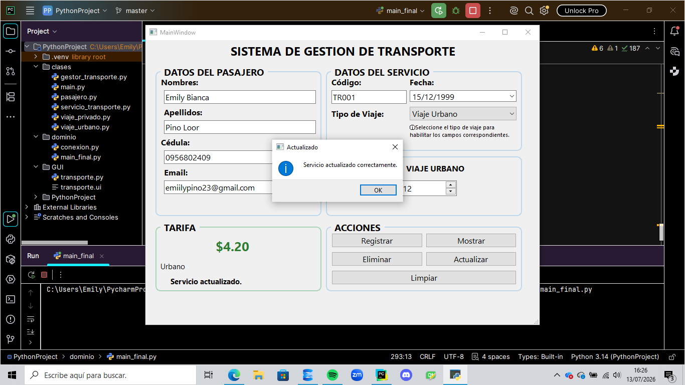
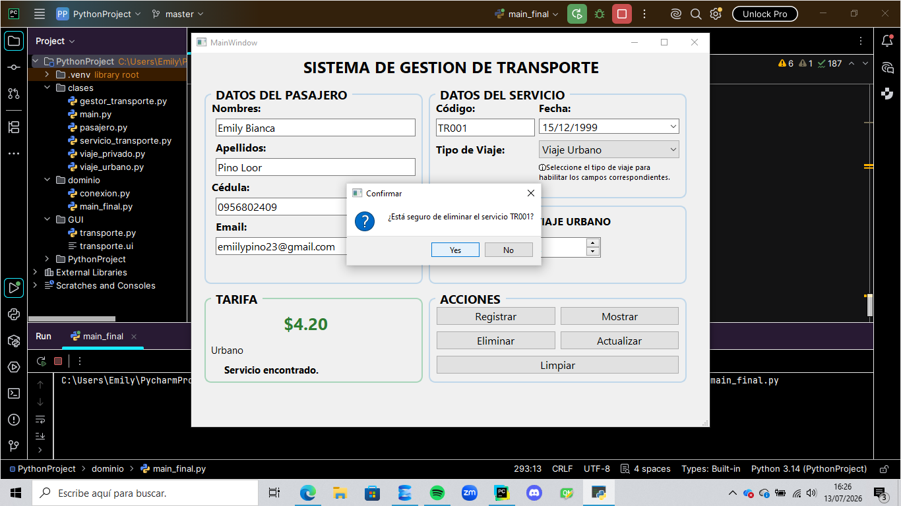
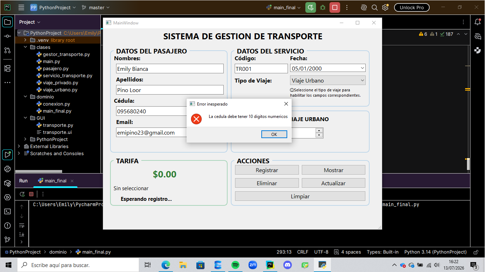
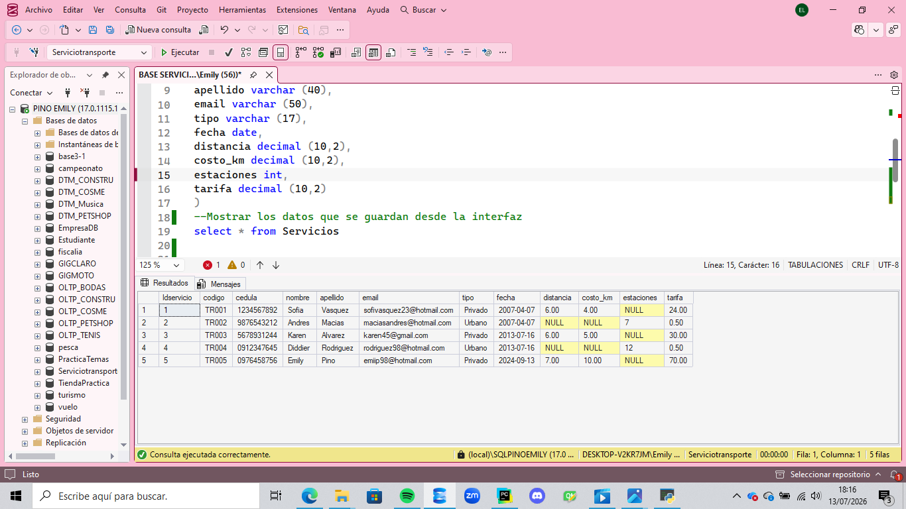

# Sistema de Gestión de Servicios de Transporte

## Descripción general

Este proyecto consiste en un sistema de escritorio desarrollado en Python utilizando Programación Orientada a Objetos y una interfaz gráfica creada con Qt Designer (PySide6). El sistema permite administrar servicios de transporte mediante un CRUD completo conectado a una base de datos SQL Server.

---

## Integrantes

- Emily Pino
- Karen Alvarez
- Sofia Vasquez
- Andres Macias
- Diddier Rodriguez

---
## Video Explicación proyecto
```
https://drive.google.com/file/d/1mp4iae8MPD9DX43g2VXeKAfHkEdwkSHB/view?usp=sharing
```

---
## Funcionalidades implementadas

- Registro de servicios de transporte.
- Generación automática del código del servicio.
- Consulta de registros almacenados.
- Actualización de información.
- Eliminación de registros.
- Cálculo automático de la tarifa.
- Validación de datos ingresados.
- Conexión con SQL Server.

---

## Tecnologías utilizadas

- Python 3
- PySide6
- Qt Designer
- SQL Server
- PyODBC
- GitHub

---

## Instrucciones para ejecutar el proyecto

1. Clonar el repositorio.
2. Abrir el proyecto en PyCharm.
3. Instalar las dependencias necesarias:

```bash
pip install PySide6
pip install pyodbc
```

4. Crear la base de datos **ServicioTransporte** en SQL Server.
5. Ejecutar el archivo `main.py`.

---

## Estructura del proyecto

```
Proyecto/
│
├── GUI/
│   ├── transporte.ui
│   └── transporte.py
│
├── clases/
│   ├── pasajero.py
│   ├── servicio_transporte.py
│   ├── viaje_privado.py
│   └── viaje_urbano.py
│
├── conexion.py
├── main.py
└── README.md
```

---

## Descripción de la base de datos
La base de datos utilizada es ServicioTransporte, desarrollada en SQL Server. El repositorio incluye el archivo ServicioTransporte.sql, el cual contiene el script necesario para crear la base de datos y la tabla Servicios con los siguientes campos:
-Idservicio       -codigo           - cedula            - nombre
-Apellido         -email            - tipo              - fecha
-Distancia        -costo_km         - estaciones        - tarifa

---

## Evidencias
### Interfaz principal



### Registro de un servicio


### Consulta de un servicio



### Actualización de un servicio



### Eliminación de un servicio



### Validación de datos



### Evidencia de la base de datos



---

## Validaciones implementadas

El sistema realiza las siguientes validaciones:

- Campos obligatorios.
- Formato del correo electrónico.
- Cédula válida.
- Código generado automáticamente.
- Valores negativos no permitidos.
- Confirmación antes de eliminar un registro.
- Mensajes de error y confirmación.

---

## Estado del proyecto

Proyecto finalizado.
Todas las funcionalidades solicitadas en la guía fueron implementadas correctamente:
- CRUD completo.
- Conexión con SQL Server.
- Interfaz gráfica.
- Programación Orientada a Objetos.
- Validaciones de datos.
